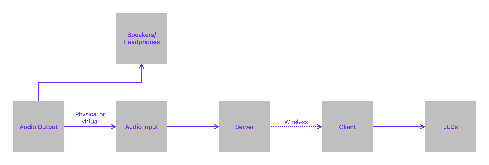

# Synesthetic Light Organ

The Synesthetic Light Organ is a real-time, sound reactive light show. The name of the project comes from the words synesthesia and aesthetic.

My goal was to be able to play a song and have LEDs illuminate with colors derived from the frequencies present in the music, resulting in a unique yet deterministic light show catered to the song. This concept is colloquially known as a light organ or color organ.

I have built this for my own enjoyment, but I wanted to make this freely available because I want everyone else to have the same opportunity. However, if you can afford it, I would appreciate that you donate to a good cause: [Donate to Code.org to support computer science education](https://code.org/donate)

## Inspiration

This project differs from off-the-shelf party lights in that party lights are a basic representation of the music, typically reacting to a sudden loud sound (e.g. a kick or snare). This means that they are easy to overwhelm - especially with long bass notes - and the visual experience is not repeatable. They certainly have their place, but I wanted something that went deeper into music.

As I sought out other options, I came across videos of people building their own light organs. I found the related GitHub projects, but I had troubles compiling them and - ultimately - they weren’t quite what I was looking for. These projects served as the inspiration to build my own.

## High Level Overview

The project consists of a [Server](https://github.com/Blast12345/LightOrganServer) and a [Client](https://github.com/Blast12345/LightOrganClient). The server’s job is to extract colors from an audio source and send the colors to the clients over WiFi. The client’s job is to receive the colors and display them on connected LEDs.

## Setup

TBD

## Contribution Guidelines

TBD
